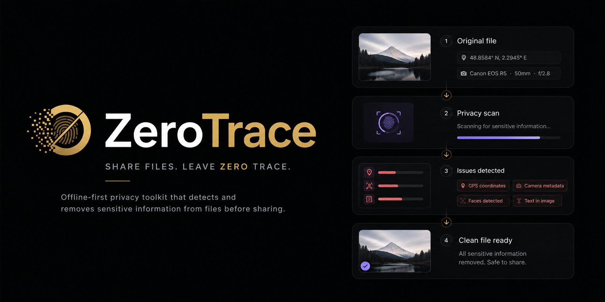
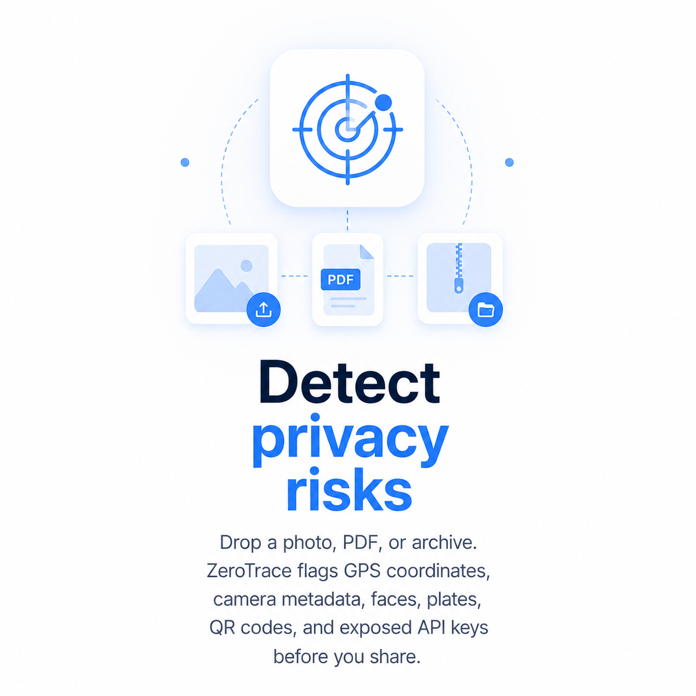
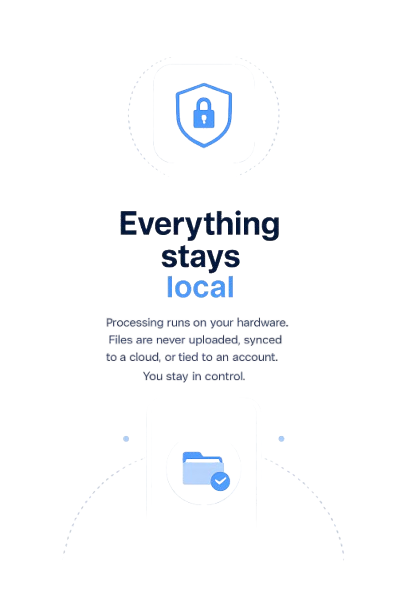
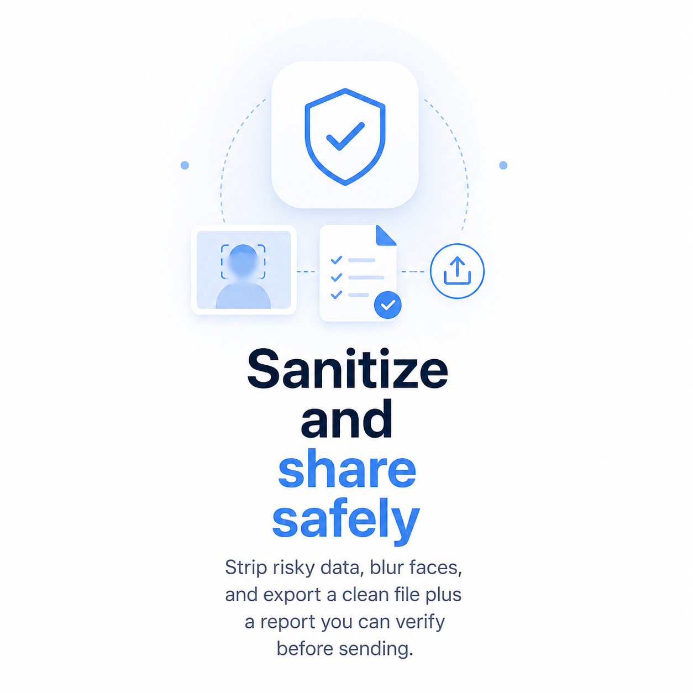

<div align="center">



# ZeroTrace

### Share files. Leave zero trace.

**ZeroTrace is a privacy-first file sanitization app — built to run entirely on your device.**
No servers. No accounts. No cloud. Just clean files, every time.

[](../../releases/latest)
[](../../releases)
[](LICENSE)
[]()

</div>

---

## What it does

Before you share a photo or document, a lot can go wrong — quietly. The GPS tag in your photo tells people exactly where you were. Office files carry your name, edit history, and machine details. Code configs hold API keys and tokens you forgot were there. Faces in photos stay identifiable.

ZeroTrace finds all of that before you hit send. Scan, review, sanitize, export. The original file is never touched — you share the clean copy.

---

## Screenshots

| Scan a file | Review findings | Export clean |
|:-----------:|:---------------:|:------------:|
|  |  |  |

---

## What's included out of the box

Four built-in scanner packs ship inside the app — no internet needed, works from the very first launch:

| Pack | What it finds |
|------|---------------|
| Privacy Essentials | EXIF metadata, GPS coordinates, camera info |
| Metadata Cleaner | Hidden metadata in PDFs, Office files, and ZIPs |
| Developer Protection | API keys, tokens, JWTs, and secret patterns in code and configs |
| QR Protection | QR codes and barcodes containing sensitive URLs or tokens |

---

## Optional packs

More powerful detection is available from the in-app marketplace. Download once, scan offline forever:

| Pack | Size | What it finds |
|------|------|---------------|
| Face Protection | ~3.5 MB | Faces at more angles; blur before sharing |
| Vehicle Protection | ~37 MB | License plates and vehicle regions in photos |
| Document Protection | ~18 MB | Personal info in scanned documents and PDF text |

All packs are signed and verified before they install. No pack ever phones home.

---

## How it works

```
Select a file  →  Scan on-device  →  Review findings  →  Fix & export
```

1. Pick any photo or document from your device
2. ZeroTrace scans it locally — nothing is uploaded, ever
3. Review what was found: metadata, faces, secrets, QR codes, and more
4. Export a sanitized copy — the original stays exactly as it was
5. Scan history lives on your device until you choose to delete it

---

## Privacy model

- Scans, findings, and exports never leave your device
- Internet is only used if you choose to download a marketplace pack
- No analytics, no telemetry, no user accounts of any kind
- No access to your camera, microphone, or contacts — only files you select
- One tap in Settings wipes everything: history, packs, and exports

---

## Platform support

| Platform | Status |
|----------|--------|
| Android (arm64) | ✅ Release APK available |
| Windows | ✅ Supported |
| macOS / Linux / iOS | 🔜 Future build |

---

## Install on Android

1. Download `app-release.apk` from [**Releases**](../../releases/latest)
2. Enable **Install from unknown sources** in your Android settings
3. Tap the APK and install
4. Open ZeroTrace and grant file access when prompted

**First thing to try:** pick any photo → tap Scan → see what it finds.

---

## Build from source

**Requirements:** Flutter 3, Dart 3, Rust toolchain

```bash
# Clone the repo
git clone https://github.com/your-username/zerotrace.git
cd zerotrace/cleanshare

# Build release APK (Android)
./tool/build_release_android.ps1

# Output
build/app/outputs/flutter-apk/app-release.apk
```

---

## Beta notes

ZeroTrace 1.0.0 Beta is pre-release software. A few honest things to know:

- On-device detection for faces, plates, and document text isn't perfect — always review findings before sharing
- Some marketplace CDN endpoints may not be live yet; built-in packs work fully offline

---

## License

[MIT](LICENSE) — free to use, modify, and distribute.

---

## Questions

Privacy questions: **Settings → Privacy policy** inside the app.

Found a bug or want a feature? [Open an issue](../../issues) — feedback makes it better.

---

<div align="center">
  <sub>Built for people who think about what travels with their files.</sub>
</div>
