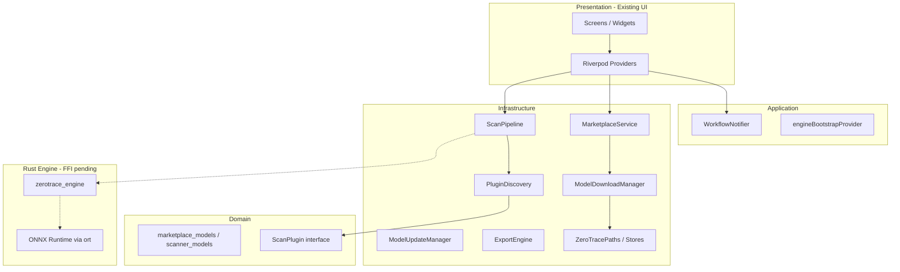
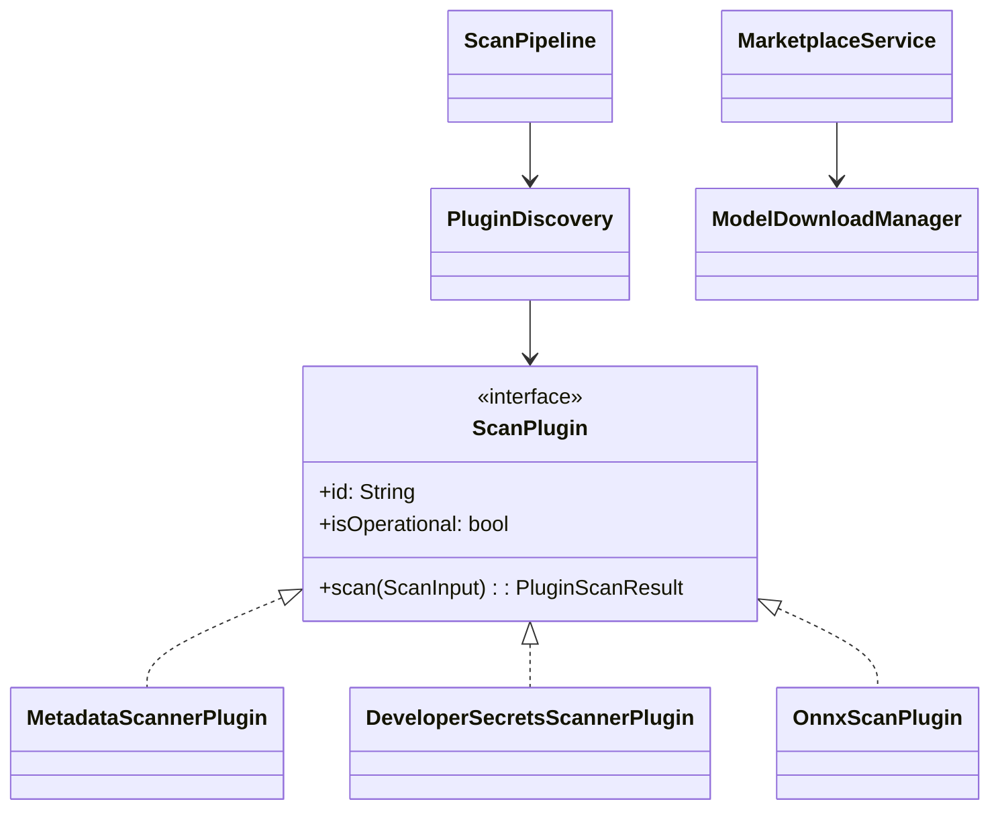

# ZeroTrace Architecture

Privacy-first, offline-first file sanitization. UI is complete; this document describes the **core engine architecture** implemented under `lib/` and `engine/`.

## Layer Diagram



## Folder Structure

```
cleanshare/
├── lib/
│   ├── domain/
│   │   ├── marketplace/marketplace_models.dart
│   │   ├── scanner/scanner_models.dart
│   │   └── storage/storage_layout.dart
│   ├── infrastructure/
│   │   ├── export/export_engine.dart
│   │   ├── marketplace/          # catalog, download, verify, update
│   │   ├── plugins/              # discovery + built-in scanners
│   │   ├── scanner/              # pipeline + risk scorer
│   │   └── storage/              # paths, history, staging
│   ├── providers/engine_providers.dart
│   ├── sdk/zerotrace_sdk.dart    # third-party manifest contract
│   ├── screens/                  # UI unchanged
│   └── widgets/
├── assets/marketplace/catalog.json
└── engine/zerotrace_engine/      # Rust scanner (metadata, secrets, ONNX)
```

## Local Storage Layout

```
{ApplicationSupport}/ZeroTrace/
├── models/           # ONNX weights by category
├── plugins/          # {plugin-id}/zerotrace.plugin.json + model files
├── cache/            # remote catalog cache
├── settings/         # installed_models.json, scan_history.json
├── logs/
├── downloads/        # transient zip downloads
├── scans/            # staged input files
└── exports/          # sanitized outputs
```

## Scanner Pipeline

1. **File staged** → `FileStagingService` copies to `scans/`
2. **PluginDiscovery** loads built-ins + disk plugins with valid manifests
3. Only **operational** plugins run (built-in metadata + secrets; ONNX when runtime + model ready)
4. Each plugin returns `PluginScanResult` independently
5. **RiskScorer** aggregates findings → `ScanPipelineResult`
6. **WorkflowNotifier** maps to existing `ScanSession` / `PrivacyFinding` UI models

## Marketplace

| Step | Component |
|------|-----------|
| Catalog | Bundled `assets/marketplace/catalog.json` + optional remote cache |
| Download | `ModelDownloadManager` — HTTP → SHA256 verify → zip extract |
| Register | `InstalledModelsStore` + `zerotrace.plugin.json` on disk |
| Update | `ModelUpdateManager` — semver compare when online |
| Remove | Delete plugin dir + index entry; other models unaffected |

Built-in models (`metadata-cleaner`, `developer-privacy-scanner`) auto-register on first launch — no download required.

## Plugin Manifest (`zerotrace.plugin.json`)

See `lib/sdk/zerotrace_sdk.dart` for the full schema. Third-party publishers package:

- Signed manifest (ed25519, future)
- ONNX or rules-based model file with SHA256
- Capability tags (`faces`, `metadata`, `secrets`, …)

`PluginDiscovery` watches `plugins/` — add/remove models without app restart.

## Security

- SHA256 verification on every download and model file
- Reject unsupported manifest formats (only `builtin`, `onnx`, `rules`)
- No arbitrary code execution — only declared model formats loaded
- Optional ed25519 signatures on catalog entries (enforced when non-empty)

## Rust Engine (`engine/zerotrace_engine`)

| Module | Responsibility |
|--------|----------------|
| `metadata` | JPEG EXIF segment detection |
| `secrets` | AWS / GitHub / JWT regex scan |
| `pipeline` | Orchestration + risk scoring |

**Next:** Wire `flutter_rust_bridge`, enable `ort` crate, set `onnxRuntimeAvailable: true` in `PluginDiscovery`.

## Implementation Roadmap

| Phase | Scope | Status |
|-------|-------|--------|
| **1** | Domain models, storage layout, built-in scanners | Done |
| **2** | Marketplace download/verify/install, settings wiring | Done |
| **3** | Scan pipeline + workflow integration | Done |
| **4** | Persistent history, export engine | Done |
| **5** | Rust FFI + ONNX inference | FFI scaffold done — build with `cargo build --release` |
| **6** | Marketplace UI screen (download buttons) | Done |
| **7** | Community registry, ratings, ed25519 signing | Future |
| **8** | ZeroTrace SDK publisher CLI | Future |

## Class Relationships



## Integration Points (UI unchanged)

| UI file | Engine hook |
|---------|-------------|
| `upload_screen.dart` | `FileStagingService.stageFrom*` |
| `scan_screen.dart` | `ScanPipeline.run()` stream |
| `workflow_provider.dart` | `completeScanFromPipeline()` |
| `settings_screen.dart` | `marketplaceItemsProvider` |
| `export_screen.dart` | `ExportEngine.export()` (wire next) |
| `app.dart` | `engineBootstrapProvider` |

---

Maintainability principles: **independent modules**, **offline-first persistence**, **plugin discovery without redeploy**, **verified downloads only**.
